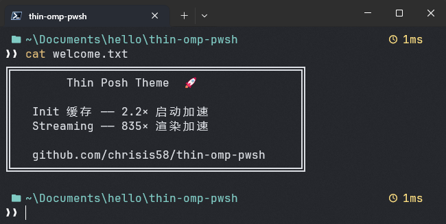

# Thin Posh Theme

一个极简、高性能的 [oh-my-posh](https://ohmyposh.dev/) PowerShell 主题。

<p align="center">
  
</p>

<table align="center">
<tr><th>指标</th><th>优化前</th><th>优化后</th><th>加速比</th></tr>
<tr><td>Shell 启动初始化</td><td>182 ms</td><td>84 ms</td><td><b>2.2x</b></td></tr>
<tr><td>单次 prompt 渲染</td><td>64.4 ms</td><td>0.08 ms</td><td><b>835x</b></td></tr>
</table>

## 功能特性

**Init 脚本缓存**： 将 `oh-my-posh init` 的输出缓存到本地，通过比较配置文件 mtime 自动判断是否需要重建。后续启动直接 dot-source 缓存，**2.2× 加速**。

**Streaming 守护进程**： `Enable-PoshStreaming` 启动 `oh-my-posh serve` 常驻后台，prompt 渲染通过管道通信而非每次 fork 新进程。**835× 加速**，单次渲染 0.08ms。

**Key Handlers**： `Enable-KeyHandlers` 在每次 Enter 时重置渲染状态，确保 streaming 模式下路径、Git 等信息始终正确刷新。

**极简设计**： 主题中 blocks 只有路径、执行耗时、退出状态三个元素。

## 安装

**前提**：[PowerShell](https://learn.microsoft.com/powershell/) ≥ 6 + [oh-my-posh](https://ohmyposh.dev/) ≥ v19 + [Nerd Font](https://www.nerdfonts.com/)

```powershell
winget install JanDeDobbeleer.OhMyPosh -s winget
```

**一行安装**：

```powershell
iwr https://raw.githubusercontent.com/chrisis58/thin-omp-pwsh/main/install.ps1 | iex
```

或手动：将 `thin.omp.json` 放到 `~/Documents/PowerShell/posh-themes/`，将 `profile.ps1` 追加到 `$PROFILE.CurrentUserAllHosts`。

## 自定义

- **调整外观**：修改 `thin.omp.json`，可改配色、增删 segment（如 Git 分支）
- **切换主题**：修改 `profile.ps1` 中的 `$ompConfig` 指向其他 oh-my-posh 主题：缓存、streaming、key handlers 等加速层与主题兼容

## 常见问题

### 图标显示为方块或乱码？

需要安装 Nerd Font。推荐 [CaskaydiaCove NF](https://www.nerdfonts.com/font-downloads)，下载后在 Windows Terminal 设置中将字体设为 `CaskaydiaCove NF`。

### Enable-PoshStreaming 报错 "command not found"？

你的 oh-my-posh 版本过低，需要 ≥ v19。运行 `oh-my-posh --version` 检查版本，使用 `winget upgrade JanDeDobbeleer.OhMyPosh` 升级。

### 切换目录后 prompt 没有更新？

确认 `Enable-KeyHandlers` 已成功加载。运行 `Get-Command Enable-KeyHandlers` 检查该命令是否可用。如果不可用，升级 oh-my-posh。

### 修改配置后 prompt 没有变化？

重启 PowerShell。缓存会在启动时检测到配置文件的修改时间变化并自动重建。也可以手动删除缓存目录强制重建：

```powershell
Remove-Item -Recurse -Force ~/.omp-cache
```

## 致谢

基于 [oh-my-posh](https://ohmyposh.dev/) 和 [PowerShell](https://github.com/PowerShell/PowerShell) 构建。

---

<div align=center> 
💬任何使用中遇到的问题、希望添加的功能，都欢迎提交 issue 交流！<br />
⭐ 如果这个项目对你有帮助，请给它一个星标！<br /> <br /> 
</div>
